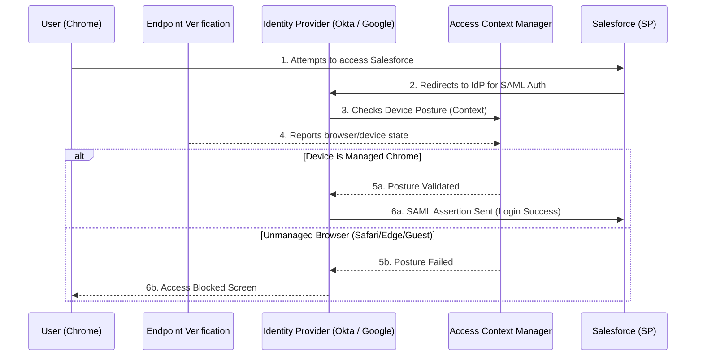

  
&nbsp;

# 🛡️ Zero Trust from Scratch: Chrome Enterprise Premium + Salesforce + SAML/Okta

## 📖 Overview

This is a comprehensive guide to building a **Zero Trust** architecture from scratch. We will use **Chrome Enterprise Premium (CEP)** to lock down a **Salesforce** environment so that it can *only* be accessed from corporate-managed Chrome browsers. 

We will cover the core concepts of SAML (Security Assertion Markup Language), how Identity Providers (like Google Workspace or Okta) interact with Service Providers (like Salesforce), and how to enforce device posture checks before a user is allowed to log in.

---

## 🏗️ Architecture Diagram

---

## 🛠️ Step-by-Step Implementation Guide

### Phase 1: Understanding the Basics (SAML & Identity)
Before clicking buttons, it's crucial to understand the flow:
* **Service Provider (SP):** The app you are trying to access (Salesforce).
* **Identity Provider (IdP):** The system verifying *who* you are (Google Workspace or Okta).
* **SAML:** The language they use to talk to each other.
* **Chrome Enterprise Premium (CEP):** The security layer sitting on top of the IdP, asking: *"Sure, you have the right password, but are you on a safe computer?"*

### Phase 2: Configure SAML Single Sign-On (SSO)
*If you are using Okta as your primary Identity Provider, you will federate Okta with Google Workspace to pass device signals.*

1. **In your IdP (Okta or Google Workspace):** Create a new SAML application for Salesforce. You will be provided with an X.509 Certificate, an Issuer URL, and a SSO Endpoint URL.
2. **In Salesforce:** Go to Setup > Single Sign-On Settings > Enable SAML.
3. Paste the Certificate and URLs from your IdP into Salesforce.
4. Download the Salesforce metadata XML and upload it back to your IdP to complete the trust bridge.

### Phase 3: Deploy Endpoint Verification (The Sensor)
CEP relies on a Chrome extension called **Endpoint Verification** to read the browser's state.
1. Go to the **Google Admin console** (`admin.google.com`).
2. Navigate to **Devices** > **Chrome** > **Apps & extensions** > **Users & browsers**.
3. Select your organizational unit (OU).
4. Click the **+** button and select **Add from Chrome Web Store**.
5. Search for `Endpoint Verification` (Extension ID: `cjanmonomjogheomcckedoohlfjncbag`) and select it.
6. Change the installation policy to **Force install**. Now, whenever an employee logs into their corporate Chrome profile, this extension silently installs.

### Phase 4: Create the Zero Trust Policy (Access Level)
Now we define what "secure" means.
1. Go to the **Google Cloud Console** (`console.cloud.google.com`) and search for **Access Context Manager**.
2. Make sure you are at the Organization level in the project selector.
3. Click **Create Access Level** and name it `Require_Managed_Chrome`.
4. Under **Conditions**, select **Device Policy**.
5. Check the box for **Require Endpoint Verification**. *(This demands that the browser must report a valid, managed state to Google).*
6. Click **Save**.

### Phase 5: Enforce the Policy on Salesforce
1. Go back to the **Google Admin console**.
2. Navigate to **Security** > **Access and data control** > **Context-Aware Access**.
3. Click **Assign Access Levels**.
4. Find your **Salesforce** SAML app (or Okta if federated) in the list and click **Assign**.
5. Select the `Require_Managed_Chrome` policy you just built.
6. Click **Save**.

---

## 🧪 Verification & Testing

### The Negative Test (Expected: Blocked)
1. Open an incognito window, Safari, Edge, or a personal unmanaged Chrome profile.
2. Go to your Salesforce login URL.
3. Attempt to authenticate.
4. **Result:** You will be intercepted by a Google/Okta error screen: *"Your organization's policy blocks access to this app."*

### The Positive Test (Expected: Success)
1. Open your managed corporate Chrome profile (where the Endpoint Verification extension is running).
2. Go to Salesforce and authenticate.
3. **Result:** The identity provider sees the secure posture from the extension and logs you in seamlessly.

---

## 🔧 Troubleshooting

- **"I'm on managed Chrome but still getting blocked!"**
  *Fix:* Click the Endpoint Verification puzzle piece icon in the browser toolbar and select **Sync Now**. It can sometimes take a few minutes for a new browser to register its secure state with the cloud.
- **Users can bypass SAML with a password:**
  *Fix:* In Salesforce, go to *My Domain* settings and disable login via the standard login page, forcing all users to route through the SAML button.
